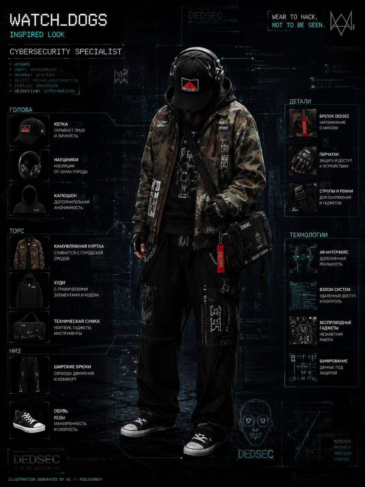
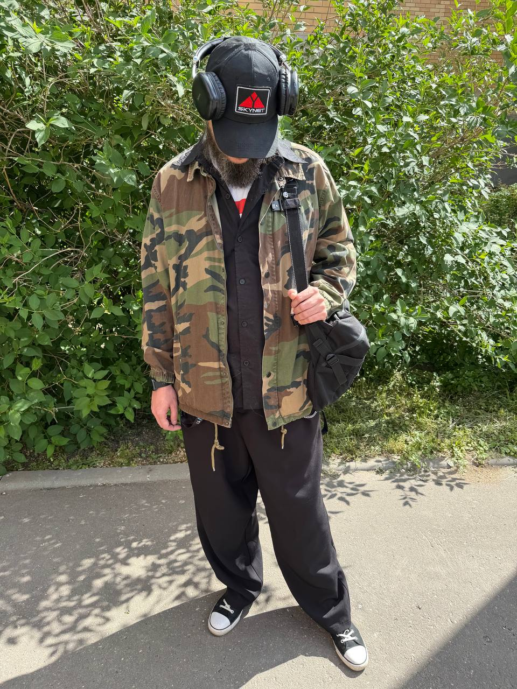
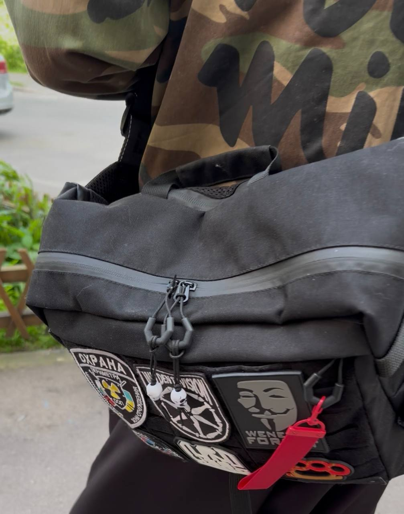

# AI Styling — Case Studies

Real wardrobe transformations. AI-generated concepts → real-life outfits.

---

## Case 001: Watch Dogs 2 — Marcus Holloway

**Client request:** *"I want the vibe of the main character from Watch Dogs 2. Urban, techwear-ish, but wearable in real life — not a costume."*

### 🧠 Step 1: AI Prototype

I fed the reference (screenshots of Marcus) into my custom AI model + Midjourney. The goal was to extract key elements:

- Layered hoodie + jacket
- Fitted dark jeans / cargo pants
- Sneakers with a tech/cyberpunk twist
- Beanie / cap as an option

**AI-generated mood board & outfit mockup:**

> *Prompt used: "Marcus Holloway Watch Dogs 2 outfit, real-world adaptation, streetwear, techwear, casual, photo-realistic, full body"*

### 👕 Step 2: Real-life sourcing

We took the AI concept and found commercially available pieces that match the silhouette, color palette (dark grey, blue, black, olive), and texture.

**Final outfit (links for reference):**

| Piece | Brand / Store | Notes |
|-------|---------------|-------|
| Military green jacket | Zara | oversized, matches the layering |
| Black shirt | No-name | urban look |
| Black Slack pants | No-name | pleated / loose fit | 
| White t-shirt with print | G-jeans | oversized, aditional layer for super iconic and stylish finish |
| White/black high-top sneakers | Newyorker | basic |
| Bag | Involt | Adds the hacker touch due to patches and skull accs |

**Real photo (client wearing the assembled look):**

### ✅ Results & Client feedback

> *"I've never thought I could look like Marcus without cosplay. Now I wear this almost every day — it's comfortable and I get compliments."*

**Key takeaway:** AI is great for inspiration and removing choice paralysis. The real value is in adapting a virtual concept to real-world budgets, body types, and store availability.

---

📅 **Want me to build a capsule wardrobe for you?**  
👉 Book a free 15-min intro call (box@kesha.cc)
