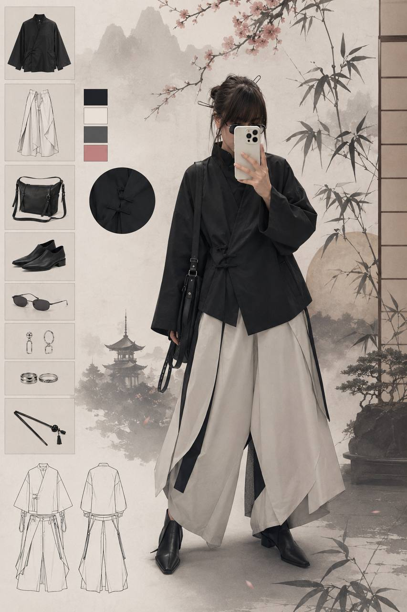
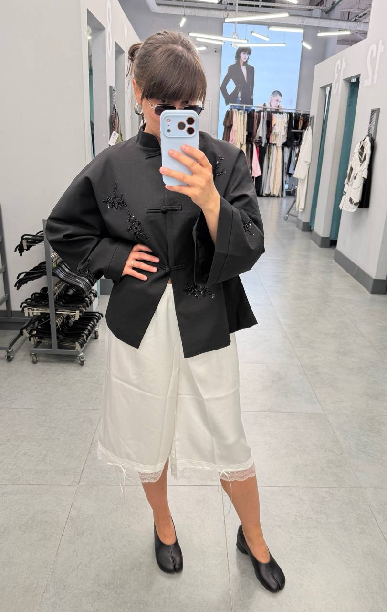
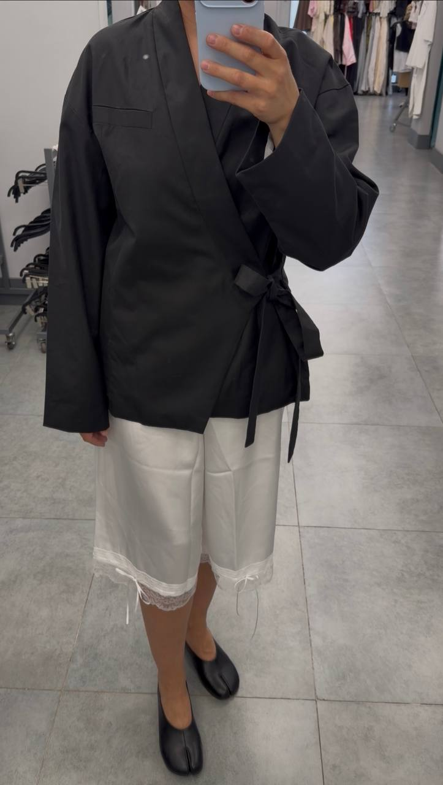

## Case 002: Asian Feminine — K‑Style Meets Soft Techwear

**Client:** Female, AI engeneer, works remotely, travels often, fond of fashion and style.  
**Request:** *"I love asian style, that is popular now. I need girly outfit I can actually wear to meet with my friends in a cozy place."*

---

### 🧠 Step 1: AI Mood Board & Concept

I ran a custom prompt through my AI pipeline (GPT + an in‑house color harmony model). The goal: extract key elements of *Asian feminine style*.

**Key traits identified by AI:**
- Asian jackets
- Aladdin pants
- Asian tops
- Tabi shoes
- Small cross‑body bag or pouch

**AI‑generated mood board & outfit mockup:**

---

### 👕 Step 2: Real‑Life Translation – No Cosplay, Just Clothes

We took the AI output and sourced real, affordable pieces (budget ~$250 total) that match the silhouette, color palette, and texture – without looking like a costume.

**Final outfit:**

| Piece | Brand / Store | Notes |
|-------|---------------|-------|
| Asian jacket | Befree |  
| Cropped lingerie-inspired pants | Befree
| Tabi shoes | O'shade | affordable option of Maison Margiela
| Sunglasses | No-name | 

**Real photo (client wearing the assembled look):**

---

### ✅ Results & Client Feedback

> *“I was afraid it would look like a costume or too ‘anime’. But this is exactly what I wanted – people just think I dress cool, not weird. And the whole outfit does not cost a fortune.”*

---

**Want a similar capsule for yourself?**  
👉 [Book a free 15‑min intro call](mailto:box@kesha.cc?subject=Styling%20for%20Asian%20feminine%20style)  
🔗 *Mention “Case 002” and get 10% off your first session.*
